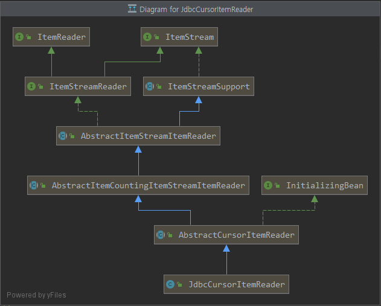
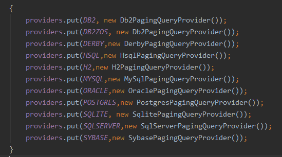

# ItemReader
Spring Batch의 ItemReader는 데이터를 읽어들입니다. 
DB 데이터뿐만 아니라 File, XML, JSON 등 다른 데이터 소스를 배치 처리의 입력으로 사용할 수 있습니다. 
 
Spring Batch에서 지원하지 않는 Reader가 필요한 경우 직접 해당 Reader를 만들수도 있습니다. 
Spring Batch는 이를 위해 Custom Reader 구현체를 만들기 쉽게 제공하고 있습니다. 
 

Spring Batch의 Reader에서 읽어올 수 있는 데이터 유형은 다음과 같습니다.
+ 입력 데이터에서 읽어오기
+ 파일에서 읽어오기
+ Database에서 읽어오기
+ Java Message Service등 다른 소스에서 읽어오기
+ 본인만의 커스텀한 Reader로 읽어오기

ItemReader의 구현체들이 어떻게 되어있는지 살펴보면 
JdbcPagingItemReader가 있습니다. 
해당 클래스의 계층 구조를 살펴보면 다음과 같습니다. 

ItemReader외에 ItemStream 인터페이스도 같이 구현되어 있습니다.  
먼저 ItemReader를 살펴보면 read()만 가지고 있습니다.
+ read()의 경우 데이터를 읽어오는 메소드입니다.

Reader가 하는 본연의 임무를 담당하는 인터페이스임을 알 수 있습니다. 
그럼 ItemStream 인터페이스는? 
ItemStream 인터페이스는 주기적으로 상태를 저장하고 오류가 발생하면 해당 상태에서 복원하기 위한 마커 인터페이스입니다. 
즉, 배치 프로세스의 실행 컨텍스트와 연계해서 ItemReader의 상태를 저장하고 실패한 곳에서 다시 실행할 수 있게 해주는 역할을 합니다. 
 

ItemStream의 3개의 메소드는 다음과 같은 역할을 합니다.
+ open(), close()는 스트림을 열고 닫습니다.
+ update()를 사용하면 Batch의 처리의 상태를 업데이트 할 수 있습니다.

개발자는 ItemReader와 ItemStream 인터페이스를 직접 구현해서 원하는 형태의 ItemReader를 만들 수 있습니다.  
다만 Spring Batch에서 대부분의 데이털 형태는 ItemReader로 이미 제공하고 있기 때문에 커스텀한 ItemReader를 구현할 일은 많이 없을 것입니다.

# Database Reader
Spring 프레임워크의 강점 중 하나는 개발자가 비즈니스 로직에만 집중할 수 있도록 JDBC와 같은 문제점을 추상화한 것입니다.
> 이를 보고 서비스 추상화라고 합니다.  
>
그래서 Spring Batch 개발자들은 Spring 프레임워크의 JDBC 기능을 확장했습니다. 
일반적으로 배치 작업은 많은 양의 데이터를 처리해야 합니다.

> 보통 실시간 처리가 어려운 대용량 데이터나 대규모 데이터일 경우에 배치 어플리케이션을 작업합니다.
>
수백만개의 데이터를 조회하는 쿼리가 있는 경우에 해당 데이터를 모두 한번에 메모리에 불러오길 원하는 개발자는 없을 것입니다. 
그러나 Spring의 JdbcTemplate은 분할 처리를 지원하지 않기 때문에 (쿼리 결과를 그대로 반환하니) 개발자가 직접 limit, offset을 사용하는 등의 작업이 필요합니다. 
Spring Batch는 이런 문제점을 해결하기 위해 2개의 Reader 타입을 지원합니다.  
Cursor는 실제로 JDBC ResultSet의 기본 기능입니다. 
ResultSet이 open 될 때마다 next()메소드가 호출 되어 Database의 데이터가 반환 됩니다. 
이를 통해 필요에 따라 Database에서 데이터를 Streaming할 수 있습니다. 

반면 Paging은 좀 더 많은 작업을 필요로 합니다. 
Paging개념은 페이지라는 Chunk로 Database에서 데이터를 검색한다는 것입니다. 
즉, 페이지 단위로 한번에 데이터를 조회해오는 방식입니다. 

Cursor 방식은 Database와 커넥션을 맺은 후, Cursor를 한칸씩 옮기면서 지속적으로 데이터를 빨아옵니다. 
반면 Paging 방식에는 한번에 10개(혹은 개발자가 지정한 PageSize)만큼 데이터를 가져옵니다. 

2개 방식의 구현체는 다음과 같습니다.
+ Cursor 기반 ItemReader 구현체
    + JdbcCursorItemReader
    + HibernateCursorItemReader
    + StoredProcedureItemReader
    
+ Paging 기반 ItemReader 구현체
    + JdbcPagingItemReader
    + HibernatePagingItemReader
    + JpaPagingItemReader
    
  

# CursorItemReader

CursorItemReader는 Paging과 다르게 Streaming으로 데이터를 처리합니다. 
쉽게 생각하시면 Database와 어플리케이션 사이에 통로를 하나 연결하고 하나씩 빨아들인다고 생각하시면 됩니다. 
JSP나 Servlet으로 게시판을 작성해보신 분들은 ResultSet을 사용해서 next()로 하나씩 데이터를 가져왔던 것을 기억하시면 됩니다.

### JdbcCursorItemReader
JdbcCursorItemReader의 설정값들은 다음과 같은 역할을 합니다.
+ chunk
    + chunkSize로 인자값을 넣은 경우는 Reader & Writer가 묶일 Chunk 트랜잭션 범위입니다.
    
+ fetchSize
    + Database에서 한번에 가져올 데이터 양을 나타냅니다.
    + Paging과는 다를 것이, Paging은 실제 쿼리를 limit, offset을 이용해서 분할 처리하는 반면 Cursor는 쿼리는 분할 처리 없이 
      실행되나 내부적으로 가져오는 데이터는 FetchSize만큼 가져와 read()를 통해서 하나씩 가져옵니다.
      

+ dataSource
    + Database에 접근하기 위해 사용할 Datasource 객체를 할당합니다.
    
+ rowMapper
    + 쿼리 결과를 Java 인스턴스로 매핑하기 위한 Mapper입니다.
    + 커스텀하게 생성해서 사용할 수 있지만, 이렇게 될 경우 매번 Mapper클래스를 생성해야 되서 보편적으로 Spring에서 공식적으로 
      지원하는 BeanPropertyRowMapper.class를 많이 사용합니다.
      
+ sql
    + Reader로 사용할 쿼리문을 사용하시면 됩니다.
    
+ name
    + reader의 이름을 지정합니다.
    + Bean의 이름이 아니며 Spring Batch의 ExecutionContext에서 저장되어질 이름입니다.

ItemReadr의 가장 큰 장점은 데이터를 Streaming 할 수 있다는 것입니다. 
read()메소드는 데이터를 하나씩 가져와 ItemWriter로 데이터를 전달하고, 다음 데이터를 다시 가져 옵니다. 
이를 통해 reader & processor & writer가 Chunk 단위로 수행되고 주기적으로 Commit됩니다. 
이는 고성능의 배치 처리에서는 핵심입니다. 

### CursorItemReader의 주의 사항
CursorItemReader를 사용하실때는 Database와 SocketTimeout을 충분히 큰 값으로 설정해야만 합니다. 
Cursor는 하나의 Connection으로 Batch가 끝날때까지 사용되기 때문에 Batch가 끝나기전에 Database와 어플리케이션의 Connection이 먼저 끊어질수 있습니다. 
그래서 Batch 수행 시간이 오래 걸리는 경우에는 PagingItemReader를 사용하시는게 낫습니다. 
Paging의 경우 한 페이지를 읽을때마다 Connection을 맺고 끊기 때문에 아무리 많은 데이터라도 타임아웃과 부하 없이 수행될 수 있습니다.

# PagingItemReader
Database Cursor를 사용하는 대신 여러 쿼리를 실행하여 각 쿼리가 결과의 일부를 가져 오는 방법도 있습니다. 
이런 처리 방법을 Paging이라고합니다. 
게시판의 페이징을 구현해보신 분들은 아시겠지만 페이징을 한다는 것은 각 쿼리에 시작 행 번호(offset)와 페이지에서 반환 할 행 수 (limit)를 지정해야함을 의미합니다. 
Spring Batch에서는 offset과 limit을 PageSize에 맞게 자동으로 생성해 줍니다. 
다만 각 쿼리는 개별적으로 실행한다는 점을 유의해야합니다. 
각 페이지마다 새로운 쿼리를 실행하므로 페이징시 결과를 정렬하는 것이 중요합니다. 
데이터 결과의 순서가 보장될 수 있도록 order by가 권장됩니다.

### JdbcPagingItemReader
JdbcCursorItemReader와 설정이 크게 다른것이 하나 있습니다. 
바로 쿼리 createQueryProvider()입니다. 
JdbcCursorItemReader를 사용할 때는 단순히 String 타입으로 쿼리를 생성했지만, PagingItemReader에서는 PagingQueryProvider를 
통해 쿼리를 생성합니다. 이렇게 사용하는데는 큰 이유가 있습니다.
 
각 Database에는 Paging을 지원하는 자체적인 전략들이 있습니다. 
때문에 Spring Batch에는 각 Database의 Paging 전략에 맞춰 구현되어야만 합니다. 
그래서 아래와 같이 각 Database에 맞는 Provider들이 존재하는데요. 

그래서 Spring Batch에서는 SqlPagingQueryProviderFactoryBean을 통해 Datasource 설정값을 보고 
위 이미지에서 작성된 Provider중 하나를 자동으로 선택하도록 합니다. 
이렇게 하면 코드 변경 사항이 적어서 Spring Batch에서 공식 지원하는 방법입니다. 
이와 다른 설정들의 값은 JdbcCursorItemReader와 크게 다르지 않습니다.
+ parameterValues
    + 쿼리에 대한 매개 변수 값의 Map을 지정합니다.
    + queryProvider.setWhereClause을 보시면 어떻게 변수를 사용하는지 자세히 알 수 있습니다.
    + where 절에서 선언된 파라미터 변수명과 parameterValues에서 선언된 파라미터 변수명이 일치해야만 합니다.